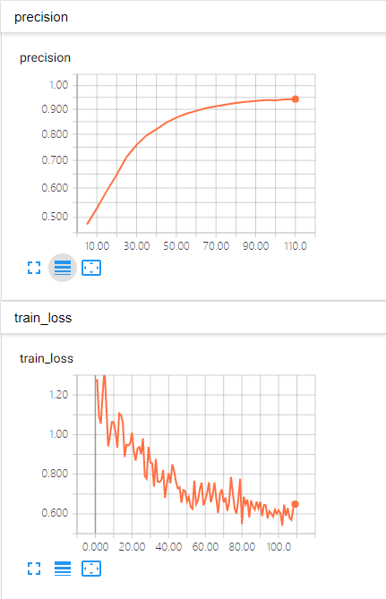

# Dogs_vs_Cats_TensorFlow_No_Keras
Dogs vs. Cats match coded by TensorFlow.

# Training
Run `demo.py`

# Tensorboard

# Evaluation
| Network | Accuracy(%)|
|---|---|
| ResNet_v1_50 | 94.28 |
- I has just trained the models for 110 steps by 'SGD'.
